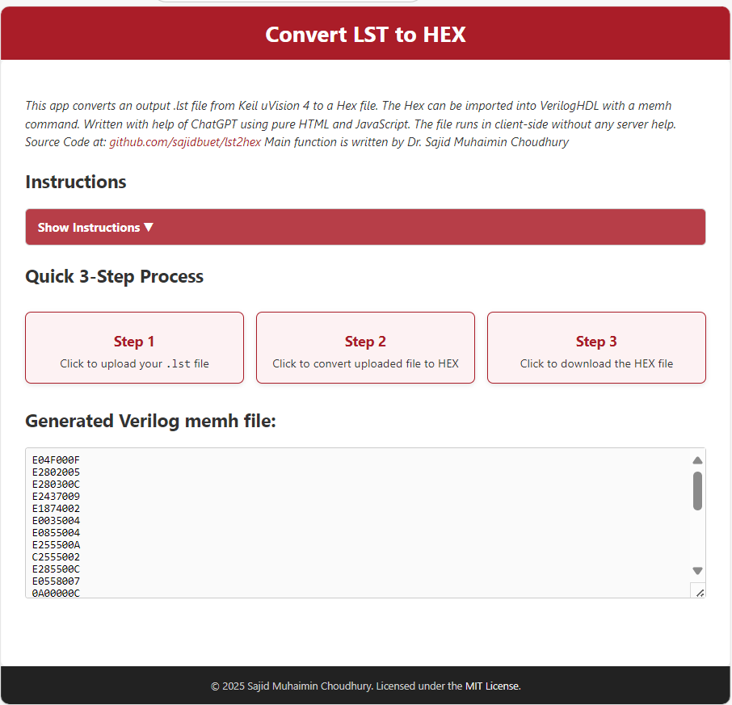

# LST to HEX Converter 🔄

A simple **browser-based tool** that converts `.lst` files generated by **Keil uVision 4** into **HEX files** that can be used in Verilog HDL projects (ModelSim, Vivado, etc.) with the `$readmemh` command.  

👉 Runs completely on **client-side JavaScript** — no server required.  
👉 Published via **GitHub Pages** for easy access.  

---

## 🚀 Live Demo
Access the converter here:  
**[LST to HEX Converter App](https://sajidmc.github.io/lst2hex/)**

---

## 📖 Features
- Upload Keil uVision 4 generated `.lst` files.  
- Convert to HEX format in one click.  
- Download the HEX file (rename as `.dat` if required).  
- Fully client-side, works offline once loaded.  
- Simple **3-step workflow** with interactive UI.  
- MIT licensed — open for educational and research use.  

---

## 🛠️ Usage Instructions

1. **Compile** your Assembly or C code using **Keil uVision 4**.  
   A `.lst` file will be generated in your project folder.  
   *(Sample `main.lst` file is included in this repository for reference.)*  

2. **Upload** the `.lst` file using the app interface.  

3. **Convert** the file by clicking on Step 2.  

4. **Download** the generated HEX file.  
   - You may rename it to `.dat` if required.  

5. **Import** the file into **ModelSim / Vivado** using the `$readmemh` command.  

---

## 📊 Workflow
The app follows a clean **3-step process**:

1. **Upload LST file** 📂  
2. **Convert to HEX** ⚙️  
3. **Download HEX file** 💾  

---

## 🎥 Demo GIF

Here’s a short demonstration of the tool in action:  

  

---

## 📸 Screenshots
*(Replace with actual screenshots of the UI if you prefer static images)*  

  
---

---

## 📜 License
This project is licensed under the [MIT License](LICENSE).  

© 2025 **Dr. Sajid Muhaimin Choudhury**

---

## 🙌 Acknowledgements
- Developed with assistance from ChatGPT.  
- Inspired by the need to quickly transform Keil outputs into usable Verilog testbench files.  
